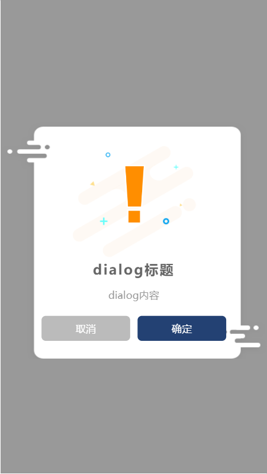

中文文档 | [Englist](./en/readme.md)

# 基于Vue3的dialog插件

>  proste： 波兰语，简单的，实在找不到什么好玩的单词了，本来想用tiga（迪迦奥特曼），但是感觉太中二了...

# 初始化插件能力

| Param |  Type     | Description       |
| :---- | :----:    | :---------------  |
| theme?  | String   | 确认按钮颜色 |
| color?   | String    | 按钮字体颜色    |


``` vue

<template>
  <HelloWorld />
</template>

<script lang="ts">
import HelloWorld from './components/HelloWorld.vue';

import {provideDialog} from 'proste-dialog';

export default ({
  name: 'App',
  components: {
    HelloWorld,
  },
  setup() {
    // 提供dialog—hook能力
    provideDialog({color: 'white', theme: 'red'});
  },
});
</script>

```

### 继承使用hook能力

| Param |  Type     | Description       |
| :---- | :----:    | :---------------  |
| type   | Number    | 0：成功，1：警告，2：错误    |
| duration?  | Number   | 展示时间，字段为0时展示按钮组            |
| title? | String | 标题 |
| content | String | 内容 |
| confirmText? | String | 确认按钮内容 |
| showCancel? | Boolean | 展示取消按钮 |
| cancelText? | String | 取消按钮内容 |
| callback? | (res: Boolean) => void | 回调方法，返回点击按钮，确认按钮返回true，取消按钮返回false|

``` vue

<template>
  <div class="hello">
    <h1>{{ msg }}</h1>
  </div>
</template>

<script>

import {useDialog} from '../plugin/proste-dialog/dist';

export default {
  name: 'HelloWorld',
  setup() {
    // 继承使用hook
    const dialog = useDialog();
    dialog({
      type: 1,
      content: '询问内容',
      confirmText: '确定',
      showCancel: true,
      cancelText: '关闭',
      callback: res => console.log(res),
    });
  },
};
</script>


```

